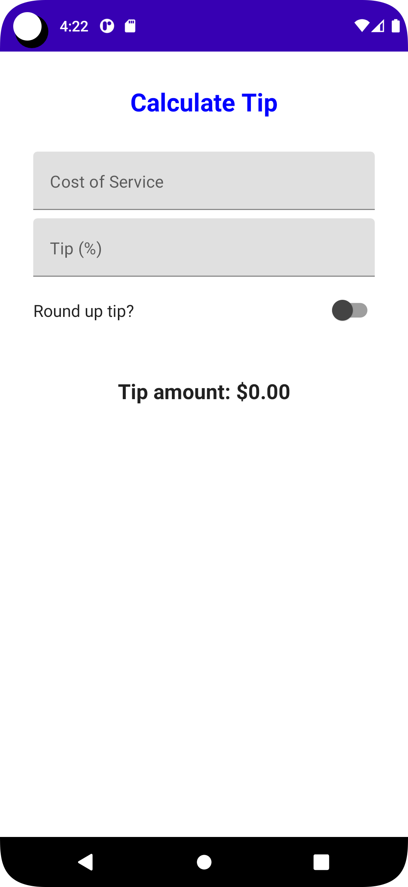
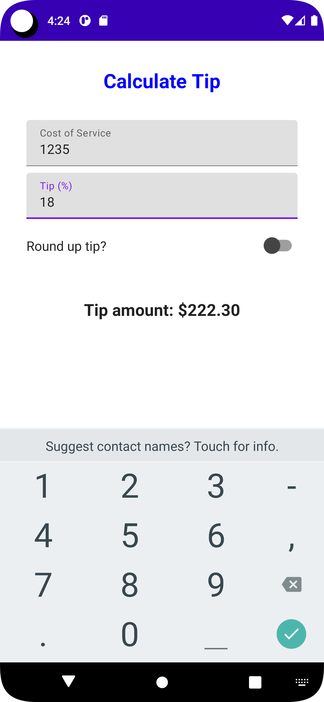
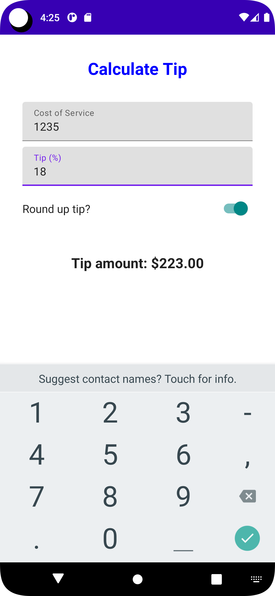

# Tip-Calculator  

# About-
Tip Calculator is made with Jetpack Compose which calculates Tip based on the cost of service.

# Screenshots-
..........

# Instructions-
1. Always work with a new branch other than master branch.
2. Spam pull requests results in permanent user block from ***Hacktoberfest 2k22***.
3. Make sure to edit ***Contributing.md*** for successful participation.

# Tasks-
1. Add Top Bar for app name.
2. Stylize the App by Standard Theming Process i.e. (Fonts, Typography, Colors, Drawables)
